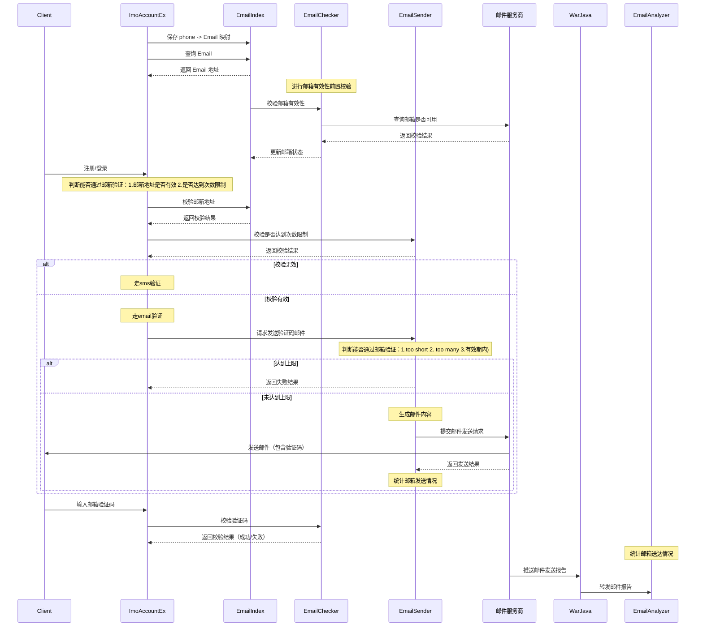

邮箱相关业务

```mermaid
sequenceDiagram
  participant Client
  participant ImoAccountEx
  participant EmailIndex
  participant EmailChecker
  participant EmailSender
  participant 邮件服务商
  participant WarJava
  participant EmailAnalyzer

  ImoAccountEx ->> EmailIndex: 保存 phone -> Email 映射
  ImoAccountEx ->> EmailIndex: 查询 Email
  EmailIndex -->> ImoAccountEx: 返回 Email 地址

  note over EmailChecker: 进行邮箱有效性前置校验
  EmailIndex ->> EmailChecker: 校验邮箱有效性
  EmailChecker ->> 邮件服务商: 查询邮箱是否可用
  邮件服务商 -->> EmailChecker: 返回校验结果
  EmailChecker -->> EmailIndex: 更新邮箱状态

  Client ->> ImoAccountEx: 注册/登录
  note over ImoAccountEx: 判断能否通过邮箱验证：1.邮箱地址是否有效 2.是否达到次数限制
  ImoAccountEx ->> EmailIndex: 校验邮箱地址
  EmailIndex -->> ImoAccountEx: 返回校验结果
  ImoAccountEx ->> EmailSender: 校验是否达到次数限制
  EmailSender -->> ImoAccountEx: 返回校验结果
  alt 校验无效
      note over ImoAccountEx: 走sms验证
  else 校验有效
      note over ImoAccountEx: 走email验证
      ImoAccountEx ->> EmailSender: 请求发送验证码邮件
      note over EmailSender: 判断能否通过邮箱验证：1.too short 2. too many 3.有效期内)
      alt 达到上限
          EmailSender -->> ImoAccountEx: 返回失败结果
      else 未达到上限
          note over EmailSender: 生成邮件内容
          EmailSender ->> 邮件服务商: 提交邮件发送请求
          邮件服务商 ->> Client: 发送邮件（包含验证码）
          邮件服务商 -->> EmailSender: 返回发送结果
          note over EmailSender: 统计邮箱发送情况
      end
  end


  Client ->> ImoAccountEx: 输入邮箱验证码
  ImoAccountEx ->> EmailChecker: 校验验证码
  EmailChecker -->> ImoAccountEx: 返回校验结果（成功/失败）

  note over EmailAnalyzer: 统计邮箱送达情况
  邮件服务商 ->> WarJava: 推送邮件发送报告
  WarJava ->> EmailAnalyzer: 转发邮件报告

```