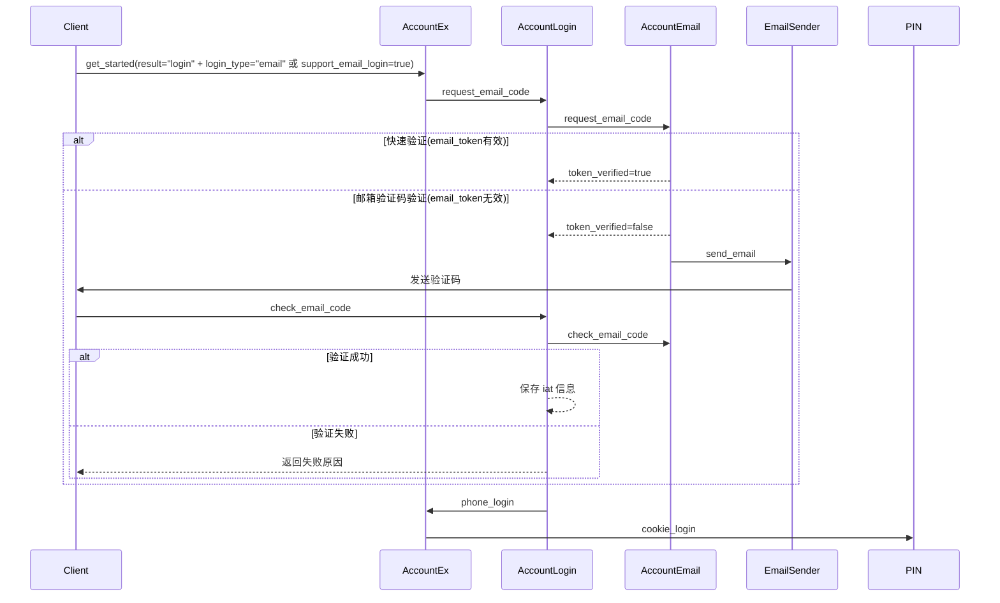

# 邮箱登录业务流程

## 1. 背景
邮箱登录业务主要用于用户通过邮箱进行账号访问和安全验证，包括快速验证和验证码验证两类场景。  
通过邮箱登录，用户可以：
- 快速登录账号（快速验证场景）  
- 使用邮箱验证码完成登录（验证码验证场景）  
- 在注册或绑定邮箱时完成邮箱验证  

> 💡 设计目标  
> - 支持邮箱快速登录，提升用户体验  
> - 与邮箱绑定流程结合，确保账号安全  
> - 提供可控的验证码频率和验证机制  

---

## 2. 业务特点与安全边界
- 邮箱登录依赖 **ImoAccountEx**、**ImoAccountLogin** 和 **ImoAccountEmail** 服务  
- 支持快速验证（自动免验证码）和验证码验证（手动输入验证码）  
- 快速验证可保存 `iat` 信息，下次登录免验证  
- 仅允许特定场景请求邮箱验证码（登录、注册、注册绑定）  

---

## 3. 总体流程概览

## 4. 流程说明

### 4.1 登录初始化
- 客户端调用 `get_started`，指定 `login_type="email"` 或 `support_email_login=true`  
- 服务端判断用户是否支持邮箱登录  

### 4.2 请求邮箱验证码（request_email_code）
- 仅允许登录、注册或注册绑定场景请求  
- 调用 `ImoAccountEmail.request_email_code`  

**快速验证**：
- `uid` 为空 → 注册强制绑定邮箱  
- 否则保存 `iat` 信息，下次登录免验证  

**验证码验证**：
- `uid` 为空 → 注册强制绑定邮箱  
- 否则发送在线 AppCode 或 Email Code  

- 注册场景可同时发送 SMS 验证，保证注册成功率  

### 4.3 校验邮箱验证码（check_email_code）
- 调用 `ImoAccountEmail.check_email_code` 完成验证码验证  
- **注册**：强制绑定邮箱  
- **登录**：走两步验证逻辑，成功保存 `iat` 信息，失败返回错误  

### 4.4 登录成功处理
- 成功验证后，调用 `ImoAccountEx.phone_login`  
- 调用 PIN 服务完成 `cookie_login`  

## 5. 核心价值
- **安全性**：结合邮箱绑定和验证码验证，确保账号安全  
- **用户体验**：支持快速登录和免验证流程  
- **可控性**：限制邮箱验证码请求场景和频率，防滥用  
- **注册保障**：在注册场景确保邮箱强制绑定，保证注册成功率
