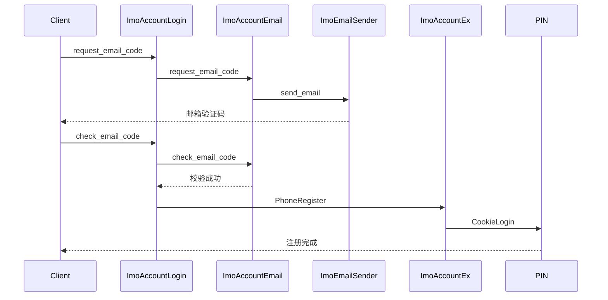

# 邮箱注册业务流程

## 1. 背景
邮箱注册是在手机号注册流程的补充方式，用于特定实验或策略命中时，通过 **邮箱验证码** 完成注册并强制绑定邮箱，提高注册成功率和账号安全性。

## 2. 入口
1. **手动下拉面板注册**  
   - 调用 `ImoAccountLogin.get_supported_verifications`  
   - 若 `enable_email_register=true`，客户端展示邮箱输入页面  

2. **手机号注册触发**  
   - 调用 `ImoAccountEx.request_phone_code`  
   - 若 `enable_email_register=true`，客户端展示邮箱输入页面

## 3. 邮箱注册核心流程

## 4. 流程说明

* **邮箱输入**：客户端校验格式合法
* **请求验证码**：调用 `request_email_code`，发送至邮箱供应商并保存数据库记录
* **校验验证码**：调用 `check_email_code`，验证正确性并更新状态
* **完成注册**：调用 `PhoneRegister`，绑定邮箱并通过 `CookieLogin` 自动登录

## 5. 核心价值

* 提升注册成功率
* 注册阶段强制绑定邮箱，增强安全
* 验证码流程统一复用，减少系统复杂度
* 可控实验策略引导，灵活上线
