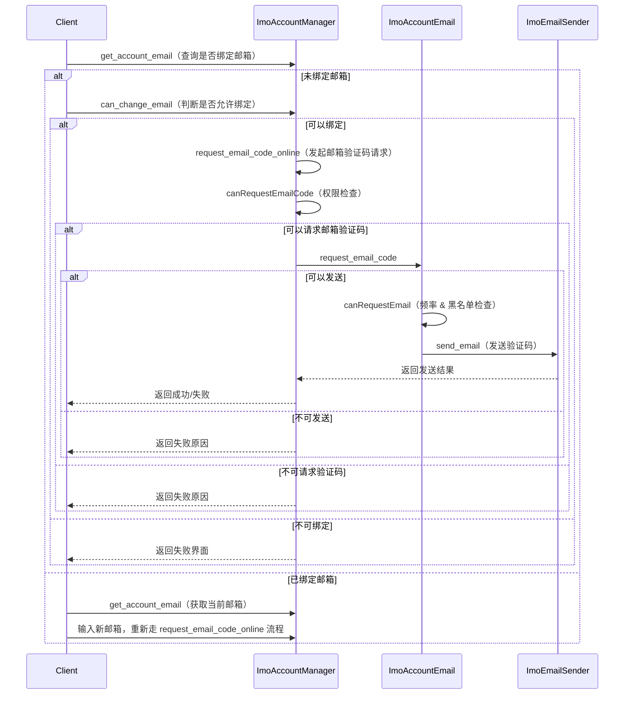

# 邮箱绑定业务流程

## 1. 背景
邮箱绑定业务主要用于用户账号安全管理，包括邮箱绑定、邮箱修改和邮箱验证功能。  
通过邮箱绑定，用户可以：
- 收到安全通知
- 进行密码找回
- 绑定/解绑邮箱以增强账号安全

> 💡 设计目标  
> - 提供安全、可控的邮箱绑定方式  
> - 支持可信设备或审核手机号快速绑定  
> - 限制频率和设备/IP 防滥用

---

## 2. 业务特点与安全边界
- 邮箱绑定操作依赖 **ImoAccountManager** 和 **ImoAccountEmail** 服务  
- 仅在 **可信设备** 或 **审核手机号** 场景下允许直接绑定  
- 对已绑定邮箱的修改需满足安全条件（验证原邮箱或使用审核手机号）  
- 请求频率受设备/IP 限制，避免滥用

---

## 3. 总体流程概览

## 4. 流程说明

### 4.1 获取当前绑定状态
- `get_account_email`：查询用户是否已有绑定邮箱  
- 如果已绑定，显示邮箱修改界面  
- 如果未绑定，显示邮箱添加界面  

### 4.2 判断是否可绑定邮箱
- `can_change_email` 判断条件：
  - 账号是否已绑定邮箱  
  - 是否为可信设备或使用审核手机号  
  - 账号是否被冻结  
- 返回允许绑定或禁止绑定的结果  

### 4.3 请求邮箱验证码
- `request_email_code_online` 发起请求  
- `canRequestEmailCode` 判断当前场景下是否有权限请求验证码：
  - 旧邮箱为空或未验证且非可信设备 → 拒绝  
  - 否则允许请求  

### 4.4 校验邮箱请求频率与可用性
- 设备每日限制注册次数（默认 1 次）  
- IP 每日限制注册次数（默认 100 次，Apollo 配置可调整）  
- `checkFrequency`：总次数限制、设备次数限制、请求间隔限制  
- `checkEmailBlock`：邮箱是否被拉黑  
- `checkEmailAccount` / `checkEmailBound` / `checkEmailNotBound`：邮箱是否可用  

### 4.5 发送邮箱验证码
- `send_email`：调用 ImoEmailSender 发送验证码  
- 成功 → ImoAccountManager 保存邮箱验证有效信息  
- 失败 → 返回失败原因给客户端  

### 4.6 邮箱修改
- 已绑定邮箱的用户可输入新邮箱，重新走请求验证码流程  
- 修改需验证旧邮箱或满足可信设备/审核手机号条件  

## 5. 核心价值
- **安全性**：仅可信设备或审核手机号可直接绑定邮箱  
- **可控性**：频率限制与黑名单机制防滥用  
- **用户体验**：支持快速绑定或修改邮箱，减少验证成本
