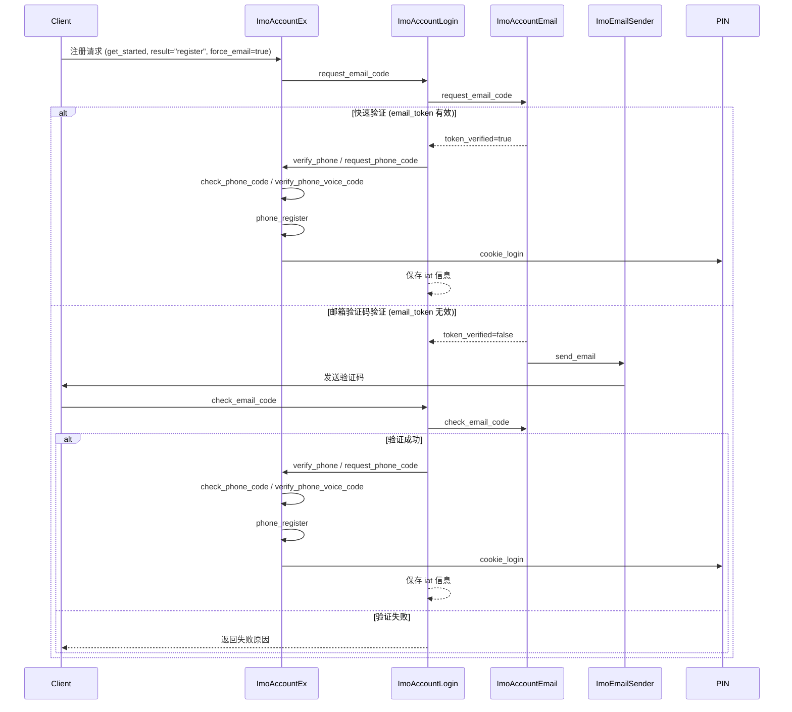

# 邮箱注册强制绑定邮箱业务流程

## 1. 背景
邮箱注册强制绑定邮箱业务主要用于用户在注册账号时，确保邮箱被绑定以增强账号安全。  
通过该流程，用户在注册时必须完成邮箱验证，同时可结合手机号验证完成双重验证，提高账号安全性。

> 💡 设计目标  
> - 强制绑定邮箱，保证注册账号可找回和安全通知  
> - 支持快速验证与验证码验证两类场景  
> - 提供可控的验证码频率和验证机制  

---

## 2. 业务特点与安全边界
- 邮箱注册绑定依赖 **ImoAccountEx**、**ImoAccountLogin**、**ImoAccountEmail** 和 **ImoEmailSender** 服务  
- 支持快速验证（自动免验证码）和验证码验证（手动输入验证码）  
- 快速验证可保存 `iat` 信息，下次登录免验证  
- 仅在注册、注册绑定场景允许请求邮箱验证码  
- 注册流程可结合手机号验证保证注册成功率  

---

## 3. 总体流程概览

## 4. 流程说明

### 4.1 注册初始化
- 客户端调用 `get_started`，设置 `result="register"` 和 `force_email=true`  
- 服务端判断用户注册场景是否需要强制绑定邮箱  

### 4.2 请求邮箱验证码（request_email_code）
- 仅允许注册、注册绑定、登录场景请求  
- 调用 `ImoAccountEmail.request_email_code`  

**快速验证**：
- `uid` 为空 → 注册强制绑定邮箱  
- 否则保存 `iat` 信息，下次登录免验证  

**验证码验证**：
- `uid` 为空 → 注册强制绑定邮箱  
- 否则发送在线 AppCode 或 Email Code  
- 注册场景可同时发送 SMS 验证，保证注册成功率  

### 4.3 校验邮箱验证码（check_email_code）
- 调用 `ImoAccountEmail.check_email_code` 完成邮箱验证  
- **注册**：强制绑定邮箱  
- 成功 → 继续手机号验证（verify_phone / request_phone_code → check_phone_code / verify_phone_voice_code）  
- 失败 → 返回失败原因给客户端  

### 4.4 注册成功处理
- 完成邮箱与手机号验证后，调用 `ImoAccountEx.phone_register`  
- 调用 PIN 服务完成 `cookie_login`  
- 快速验证成功时，保存 `iat` 信息以支持下次登录免验证  

## 5. 核心价值
- **安全性**：注册必须绑定邮箱，确保账号安全与可找回性  
- **可控性**：限制邮箱验证码请求场景和频率，防滥用  
- **用户体验**：快速验证可减少验证码输入，注册流程顺畅  
- **注册保障**：结合手机号验证，保证注册成功率  
