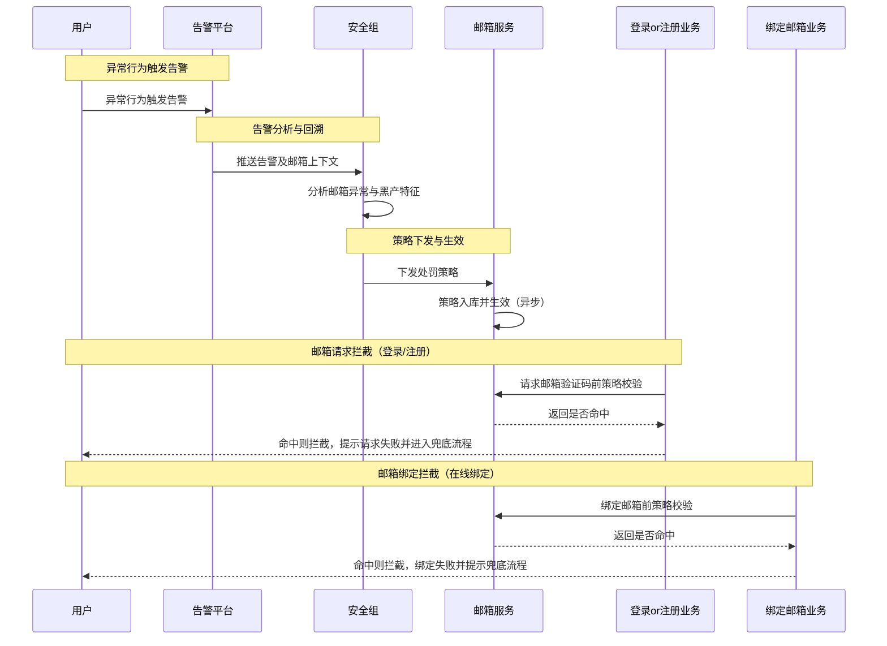

```mermaid
sequenceDiagram
    participant 用户
    participant 告警平台
    participant 安全组
    participant 邮箱服务
    participant 登录or注册业务
    participant 绑定邮箱业务

    Note over 用户,告警平台: 异常行为触发告警
    用户->>告警平台: 异常行为触发告警

    Note over 告警平台,安全组: 告警分析与回溯
    告警平台->>安全组: 推送告警及邮箱上下文
    安全组->>安全组: 分析邮箱异常与黑产特征

    Note over 安全组,邮箱服务: 策略下发与生效
    安全组->>邮箱服务: 下发处罚策略
    邮箱服务->>邮箱服务: 策略入库并生效（异步）

    Note over 登录or注册业务,用户: 邮箱请求拦截（登录/注册）
    登录or注册业务->>邮箱服务: 请求邮箱验证码前策略校验
    邮箱服务-->>登录or注册业务: 返回是否命中
    登录or注册业务-->>用户: 命中则拦截，提示请求失败并进入兜底流程

    Note over 绑定邮箱业务,用户: 邮箱绑定拦截（在线绑定）
    绑定邮箱业务->>邮箱服务: 绑定邮箱前策略校验
    邮箱服务-->>绑定邮箱业务: 返回是否命中
    绑定邮箱业务-->>用户: 命中则拦截，绑定失败并提示兜底流程
```