# 系统设计面试高频题目与准备指南

## 1. 类 Twitter / 微博系统（社交 Feed）

### 场景
设计一个类似 Twitter 的系统，支持用户发帖、关注、时间线展示。

### 一、需求澄清
- 功能性需求
    - 用户是否需要：
        - 发帖（文本为主，先不考虑图片视频）
        - 关注 / 取关
        - 查看时间线（Home Timeline）
    - 时间线是：
        - 按时间倒序？
        - 只看关注的人？

- 非功能性需求
    - 这是一个 读多写少、高并发、低延迟 的系统，且需要支持水平扩展
    - DAU：千万级
    - 发帖 QPS：中等
    - 读时间线 QPS：极高
    - 可接受 最终一致性

### 二、高层架构
整体采用微服务架构，前端请求通过 API Gateway 进入不同的后端服务。
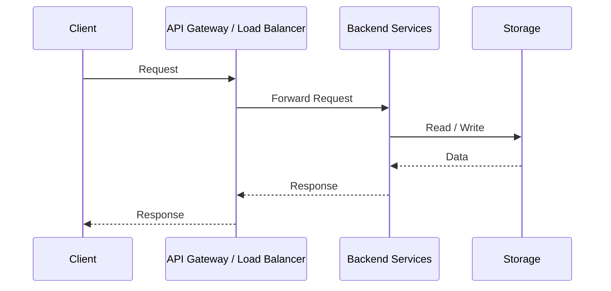

### 三、组件拆解
- 核心服务拆分
    - User Service: 用户信息
    - Follow Service: 关注关系
    - Post Service: 发帖
    - Timeline Service: 时间线生成

我会把关注关系、发帖和时间线生成解耦，避免写操作和读操作相互影响

- 存储选型
    - User/Follow/Post： 关系型或分布式KV
        - 核心实体数据（User / Follow / Post）落在持久化、可扩展的存储中
    - Timeline： Redis/Cache
        - 高读、高冗余、可最终一致的数据（Timeline）放在 Redis
    - 异步任务： MQ
        - 下游、写放大的流程通过 MQ 解耦，保证主链路稳定

### 四、数据流
- 写路径： 用户发帖
    - 用户发帖时，先写post表，然后通过消息队列异步通知时间线系统
- 读路径：查看时间线
    - 时间线有两种生成方式：Push 和 Pull,采用 Push 为主，Pull 为辅的混合方案
    - push:用户发帖+系统把帖子 推送到所有粉丝的时间线缓存
    - pull:用户请求时间线+实时从关注用户的 Post 表中拉取

### 五、扩展性与权衡
- 数据扩展
    - User ID / Post ID 分库分表
    - Follow 表按 follower_id 分区

- 缓存扩展
    - 时间线按用户维度缓存
    - 热点用户（大 V）特殊处理：
        - 不 Push
        - 读时 Pull

- 服务扩展
    - 所有服务无状态
    - 通过水平扩展应对流量增长

### 六、限制条件 & 权衡（Trade-off）
- 一致性 VS 性能：时间线时最终一致的，允许短暂延迟
- 写放大 VS 读性能：Push模式写放大，但换取极快的读取性能
- 存储成本 VS 体验： 时间线冗余存储，增加成本，但显著提升用户体验

### 七、总结
总体来讲，先澄清功能和非功能需求，然后设计了以微服务为核心的架构，通过异步化和缓存来解耦读写压力，在时间线生成上，采用push+pull的混合方案，并对热点用户做了特殊处理，从而在扩展性和性能之间取得平衡

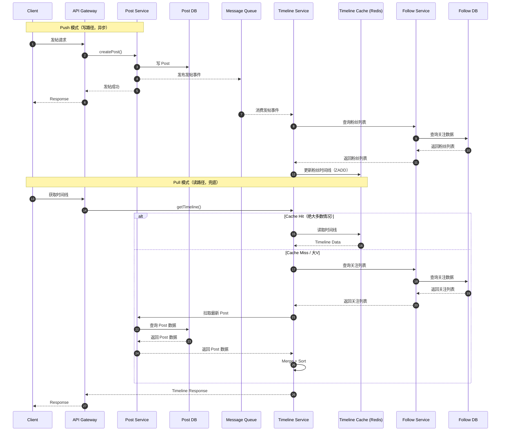

---

## 2. 即时聊天系统（IM）

### 场景
设计一个类似 WhatsApp / Slack 的聊天系统。

### 一、需求澄清
- 功能性需求
    - 用户是否需要：
        - 发送文本消息（先不考虑语音、视频、文件）
        - 消息回执：已发送 / 已送达 / 已读
        - 群聊与一对一聊天
        - 拉取历史消息
        - 离线消息推送（断线重连时能收到消息）
    - 消息顺序：
        - 保证单聊、群聊消息按时间顺序可展示
- 非功能性需求
    - 高并发低延迟，读写 QPS 都很高
    - 可水平扩展
    - 消息允许最终一致性（短时间延迟可接受）

### 二、高层架构
整体采用微服务 + 消息队列 + 缓存架构，前端请求通过 API Gateway 分发到不同的 IM 服务。
### 三、组件拆解

#### 核心服务拆分
- User Service: 用户信息
- Chat Service: 消息发送与接收
- Conversation Service: 会话管理（单聊/群聊）
- Presence Service: 用户在线状态

#### 存储选型
- User/Conversation/Message：关系型或分布式 KV
    - 消息持久化存储保证可靠性
- 消息缓存：Redis / 内存队列
    - 离线消息缓存、在线推送
- 异步任务：MQ
    - 消息广播、离线消息推送解耦

### 四、数据流

#### 写路径：发送消息
- 用户发送消息 → Chat Service → 持久化到 Message DB → 发布到 MQ
- 消息消费者：
    - 在线用户 → 推送到对应客户端
    - 离线用户 → 缓存到 Redis / 离线队列

#### 读路径：拉取消息 / 历史消息
- Client 请求历史消息 → Chat Service → Message DB 查询 → 返回给客户端
- 在线消息可直接从缓存中读取

### 五、扩展性与权衡

#### 数据扩展
- Message ID / Conversation ID 分库分表
- 群聊消息可按群 ID 分区

#### 缓存扩展
- 在线消息和离线消息缓存按用户维度或会话维度

#### 服务扩展
- 所有服务无状态，通过水平扩展应对流量增长

#### 高可用
- 消息队列多副本
- 数据库主从 / 分片

### 六、限制条件 & 权衡
- 一致性 VS 性能：允许短时间消息延迟，保证系统高吞吐
- 消息持久化 VS 内存缓存：热消息缓存提高响应速度，冷消息持久化保证可靠性
- 在线状态 VS 推送：在线用户实时推送，离线用户通过缓存/离线队列延迟推送

### 七、总结
IM 系统读写压力大，要求低延迟和高可用。通过微服务拆分、消息队列异步处理、缓存加速以及分库分表，实现消息发送、接收、推送和历史查询的可靠、高效处理。同时允许最终一致性来保证系统可扩展性和性能。

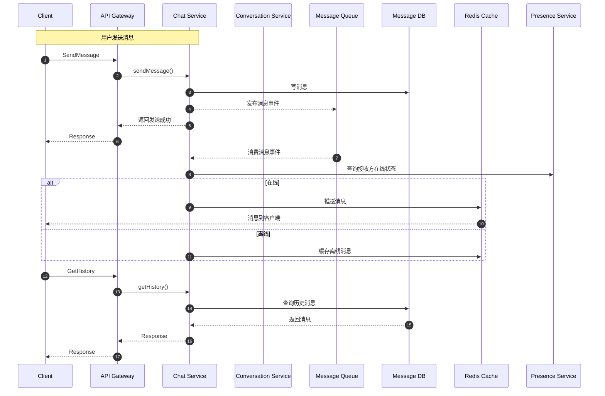

---

## 3. 电商秒杀系统

### 场景
设计一个支持高并发秒杀的电商系统，需要在短时间内处理大量请求，同时保证库存正确性和下单成功率。

### 一、需求澄清
- 功能性需求
    - 用户是否需要：
        - 商品秒杀下单
        - 库存实时更新
        - 订单状态查询
        - 秒杀结果通知（成功 / 失败）
- 非功能性需求
    - 高并发（瞬时 QPS 很高）
    - 系统可水平扩展
    - 保证库存正确性，避免超卖
    - 可接受秒杀结果延迟（最终一致性）

### 三、组件拆解

#### 核心服务拆分
- User Service: 用户信息
- Product Service: 商品信息与库存管理
- Order Service: 订单创建与管理
- Seckill Service: 秒杀活动逻辑
- MQ Service: 异步消息处理

#### 存储选型
- Product/Inventory/Order：关系型数据库或分布式 KV
    - 商品库存持久化
    - 订单持久化
- 缓存：Redis / 内存队列
    - 秒杀库存预热
    - 秒杀请求限流
- 异步任务：MQ
    - 秒杀请求异步下单
    - 延迟队列处理订单状态

### 四、数据流

#### 写路径：秒杀下单
- 用户请求秒杀 → API Gateway → Seckill Service
- Seckill Service 校验活动 & 用户资格 → 减库存（Redis/缓存预减）
- 秒杀请求异步发送到 MQ → Order Service 创建订单 → 持久化到 Order DB
- MQ 消费失败或库存不足 → 返回秒杀失败
- 成功消息推送给用户

#### 读路径：秒杀查询 / 历史订单
- 用户查询秒杀结果 → API Gateway → Order Service → Order DB 查询 → 返回结果
- 秒杀活动信息可缓存 → 通过 Redis 提高访问速度

### 五、扩展性与权衡

#### 数据扩展
- 商品/库存分库分表
- 订单按时间或用户分区

#### 缓存扩展
- 秒杀库存缓存按商品维度
- 热点商品库存使用本地缓存 + Redis 双层缓存

#### 服务扩展
- 所有服务无状态，通过水平扩展应对高并发
- MQ 多副本保证消息可靠

#### 高可用
- 数据库主从 / 分片
- 秒杀活动服务可多副本部署

### 六、限制条件 & 权衡
- 一致性 VS 性能：允许短时间库存最终一致，保证系统高吞吐
- 缓存预减 VS 实际库存：通过 MQ 异步校验避免超卖
- 高并发 VS 系统稳定性：使用限流、排队、异步下单控制瞬时压力

### 七、总结
秒杀系统需要应对瞬时高并发和库存正确性问题。通过缓存预减库存、异步下单、消息队列、限流排队等策略，实现高性能、高可用和最终一致性保证，同时保证秒杀结果能及时反馈给用户。

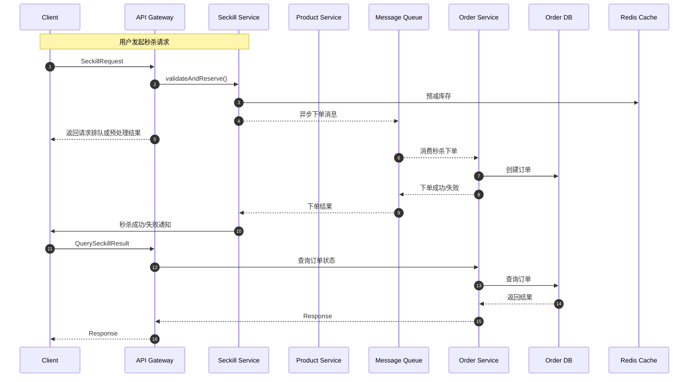

---

## 4. 视频 / 图片存储系统

### 场景
设计一个类似 YouTube 的视频存储和分发系统，需要支持视频上传、转码、存储和分发，同时保证高可用、高并发和低延迟访问。

### 一、需求澄清
- 功能性需求
    - 用户是否需要：
        - 视频/图片上传
        - 视频转码（多分辨率）
        - 视频/图片下载与播放
        - 支持 CDN 分发和流量分层
        - 查询视频/图片信息
    - 支持的视频格式、分辨率和码率
- 非功能性需求
    - 海量存储和高并发访问
    - 高可用，数据安全
    - 上传/下载性能优化
    - 支持水平扩展和分布式存储

### 三、组件拆解

#### 核心服务拆分
- User Service: 用户信息管理
- Upload Service: 文件上传接口
- Media Service: 视频转码、格式处理
- Storage Service: 文件存储管理
- CDN / Distribution Service: 内容分发加速
- Metadata Service: 视频/图片元数据管理

#### 存储选型
- 原始文件存储：分布式对象存储（如 S3、MinIO）
- 转码后文件：分布式对象存储，分辨率 / 码率多版本
- 元数据：关系型数据库或 NoSQL（视频信息、用户信息、评论等）
- 缓存：Redis / CDN
    - 热视频缓存
    - 加速播放请求

#### 异步任务
- 消息队列（MQ）用于：
    - 视频转码任务异步处理
    - 元数据更新通知
    - 异步推送到 CDN

### 四、数据流

#### 上传路径
- 用户上传视频 → Upload Service → 存储原始文件到 Storage Service
- Upload Service 发布转码任务到 MQ → Media Service 转码 → 存储转码文件到 Storage Service
- Metadata Service 更新视频信息和转码状态

#### 下载 / 播放路径
- 用户请求视频播放 → Metadata Service 查询视频信息
- CDN / Storage Service 返回视频流或图片
- 热门视频通过 CDN 缓存加速访问

### 五、扩展性与权衡

#### 数据扩展
- 文件存储按对象分区 / 分桶
- 元数据按用户或视频分库分表

#### 缓存扩展
- 热门视频缓存到 Redis / CDN
- 分层缓存提高访问效率

#### 服务扩展
- 上传服务、转码服务、存储服务无状态，可水平扩展
- MQ 多副本保证任务可靠

#### 高可用
- 存储多副本，保证数据可靠性
- 转码服务可多副本处理任务
- CDN 节点分布式加速

### 六、限制条件 & 权衡
- 一致性 VS 性能：上传完成后转码异步处理，最终一致
- 存储成本 VS 可访问性：多分辨率、多副本提高用户体验，但增加成本
- 高并发访问 VS 服务稳定性：通过 CDN、缓存和分布式存储缓解压力

### 七、总结
视频 / 图片存储系统需应对海量文件存储和高并发访问，通过微服务拆分、分布式存储、异步转码和 CDN 缓存，实现可靠、高性能的视频上传、转码和分发。同时保证系统可扩展性和最终一致性。

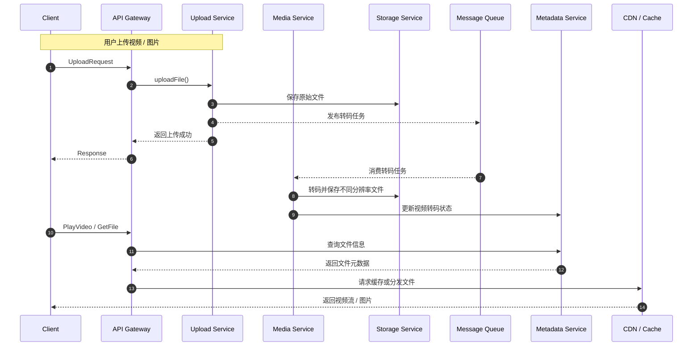

---

## 5. 搜索系统（全文搜索）

### 场景
设计一个支持全文搜索的系统，需要提供快速、高并发的搜索能力，同时保证数据的实时性和可扩展性。典型场景包括网站搜索、商品搜索、文档搜索等。

### 一、需求澄清
- 功能性需求
    - 支持关键字全文检索
    - 支持搜索结果排序（时间、相关度）
    - 支持分页和高亮展示
    - 支持搜索结果过滤（分类、标签等）
    - 支持索引实时更新（新增/修改/删除文档）
- 非功能性需求
    - 高并发查询，低延迟响应
    - 支持海量数据（数亿级文档）
    - 系统可水平扩展
    - 数据最终一致性可接受（索引延迟几秒到几十秒）

### 三、组件拆解

#### 核心服务拆分
- User / Client: 搜索请求来源
- Search Service: 搜索接口和查询服务
- Indexing Service: 索引生成与更新
- Document Storage Service: 原始文档存储
- Cache Service: 热点查询缓存
- MQ Service: 异步任务处理（增量索引、同步更新）

#### 存储选型
- 原始文档存储：关系型数据库或分布式 KV
- 索引存储：Elasticsearch / Solr / 其他搜索引擎
- 缓存：Redis
    - 热门查询缓存
- 异步任务队列：消息队列 MQ
    - 异步索引更新、批量增量更新

### 四、数据流

#### 写路径：文档索引更新
- 新文档或文档更新 → Document Storage Service → 持久化
- Indexing Service 异步消费 MQ 消息 → 更新索引到搜索引擎
- Metadata / 文档状态同步更新

#### 读路径：搜索查询
- 用户搜索请求 → API Gateway → Search Service
- Search Service 查询索引：
    - 缓存命中：直接返回结果
    - 缓存未命中：查询搜索引擎索引
- 返回排序、分页、高亮后的搜索结果

### 五、扩展性与权衡

#### 数据扩展
- 文档按类型或 ID 分片
- 索引按 Shard 分布式存储

#### 缓存扩展
- 热点查询缓存
- 结果分页缓存，提高重复请求性能

#### 服务扩展
- Search Service 无状态，可水平扩展
- Indexing Service 可多实例异步消费消息队列

#### 高可用
- 索引分片副本
- 消息队列多副本保证任务可靠
- 搜索服务多副本部署

### 六、限制条件 & 权衡
- 一致性 VS 查询性能：索引更新异步，允许几秒延迟
- 热点数据缓存 VS 内存成本：缓存提高响应速度，但占用内存
- 查询复杂度 VS 并发性能：支持排序、过滤和高亮，但复杂查询可能增加延迟

### 七、总结
全文搜索系统通过索引服务和缓存加速查询，同时利用异步消息队列保证索引实时更新。通过分片、副本和水平扩展，实现高并发、高可用和低延迟的搜索体验，同时在最终一致性和查询性能之间做权衡。

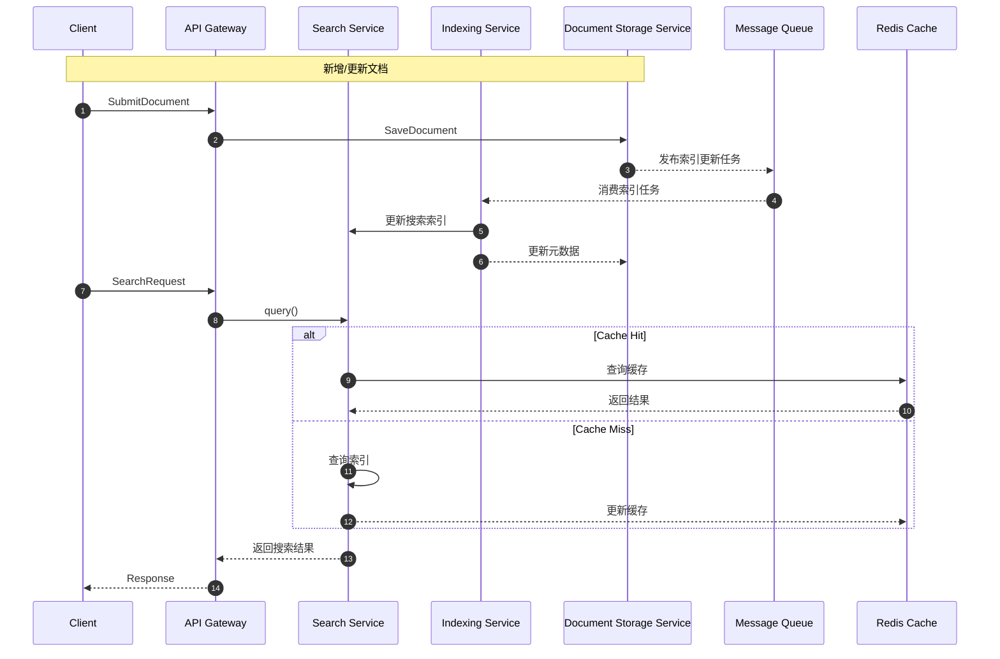

---

## 6. 推荐系统

### 场景
设计一个商品或内容推荐系统，需要根据用户行为、偏好和历史数据生成个性化推荐，同时保证高并发和实时性。

### 一、需求澄清
- 功能性需求
    - 用户是否需要：
        - 个性化推荐（首页、列表页、详情页）
        - 热门推荐 / 实时推荐
        - 支持不同推荐策略（协同过滤、内容推荐、混合推荐）
        - 推荐结果点击追踪和反馈
- 非功能性需求
    - 高并发请求，低延迟返回推荐结果
    - 推荐数据实时更新（用户行为实时影响推荐）
    - 支持海量用户和商品/内容
    - 可水平扩展

### 三、组件拆解

#### 核心服务拆分
- User Service: 用户信息管理
- Item / Content Service: 商品或内容信息管理
- Recommendation Service: 推荐算法计算和接口
- Behavior / Event Service: 用户行为数据收集
- Ranking / Filtering Service: 推荐结果排序和过滤
- Cache Service: 推荐结果缓存
- MQ Service: 异步任务处理（离线推荐、模型训练）

#### 存储选型
- 用户行为数据：Kafka / MQ / 分布式数据库
- 商品/内容数据：关系型或 NoSQL 存储
- 离线推荐结果：分布式 KV 或数据库
- 实时推荐结果：Redis / Cache
- 模型存储：文件系统或对象存储

#### 异步任务
- 消息队列（MQ）用于：
    - 用户行为流入离线推荐计算
    - 离线模型训练任务
    - 实时推荐更新

### 四、数据流

#### 写路径：用户行为收集
- 用户行为 → Event Service → MQ → Behavior DB / Offline Processing
- 离线推荐计算 → 更新推荐表 / Cache

#### 读路径：推荐结果查询
- 用户访问推荐页面 → API Gateway → Recommendation Service
- Recommendation Service 查询：
    - 缓存命中：直接返回结果
    - 缓存未命中：查询实时推荐计算或离线推荐表
- 返回排序后的推荐列表给用户

### 五、扩展性与权衡

#### 数据扩展
- 用户行为、商品数据分片存储
- 离线推荐表按用户维度分区

#### 缓存扩展
- 热门推荐缓存
- 用户个性化推荐缓存，按用户 ID 分区

#### 服务扩展
- 推荐服务无状态，可水平扩展
- 离线计算任务通过分布式集群处理

#### 高可用
- 缓存多副本
- 消息队列多副本保证任务可靠
- 推荐服务多副本部署

### 六、限制条件 & 权衡
- 一致性 VS 性能：实时推荐可近似，允许短延迟
- 缓存 VS 数据新鲜度：缓存提高响应速度，但可能导致推荐延迟
- 离线 VS 实时计算：离线计算规模大但延迟高，实时计算延迟低但计算量大

### 七、总结
推荐系统通过离线和实时计算结合，实现个性化推荐，同时利用缓存和异步任务提升查询性能和系统可扩展性。在高并发环境下，通过分布式存储、消息队列和无状态服务保证推荐结果的可用性和低延迟。

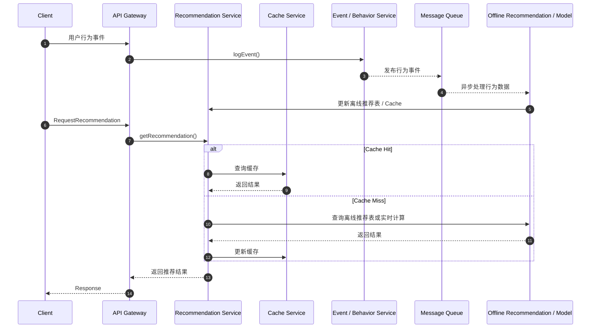

---

## 7. 在线协作文档系统

### 场景
设计一个支持多人实时编辑的文档系统，需要保证文档的实时协作、冲突解决和版本管理，同时支持高并发访问和低延迟更新。

### 一、需求澄清
- 功能性需求
    - 用户是否需要：
        - 多人实时编辑同一文档
        - 光标和选择同步显示
        - 文档历史版本管理
        - 权限管理（读/写/共享）
        - 离线编辑和自动同步
- 非功能性需求
    - 高并发低延迟，编辑冲突少
    - 数据最终一致性可接受
    - 支持大文档和多用户协作
    - 可水平扩展

### 三、组件拆解

#### 核心服务拆分
- User Service: 用户信息和权限管理
- Document Service: 文档存储和管理
- Collaboration Service: 实时协作与编辑同步
- Versioning Service: 文档版本管理
- Presence Service: 用户在线状态
- Cache Service: 编辑状态和临时数据缓存
- MQ Service: 异步任务（离线同步、通知）

#### 存储选型
- 文档内容：关系型或分布式 KV
- 编辑操作缓存：Redis / 内存队列（用于实时同步）
- 文档历史版本：对象存储或数据库
- 异步任务队列：消息队列 MQ
    - 离线编辑同步
    - 通知推送

### 四、数据流

#### 写路径：实时编辑
- 用户编辑文档 → Collaboration Service → 更新临时缓存（Redis） → 异步发送变更到 MQ → Document Service 持久化 → Versioning Service 记录版本
- 编辑操作广播：
    - 在线用户 → 实时推送操作同步
    - 离线用户 → 离线变更缓存

#### 读路径：文档打开 / 历史版本
- 用户打开文档 → Document Service 查询最新文档 → Collaboration Service 同步当前编辑状态
- 历史版本查询 → Versioning Service 查询 → 返回版本数据

### 五、扩展性与权衡

#### 数据扩展
- 文档按文档 ID 或团队分片
- 版本历史按文档分区存储

#### 缓存扩展
- 临时编辑操作按文档或用户分区
- 在线协作状态缓存，提高实时同步性能

#### 服务扩展
- Collaboration Service、Document Service 无状态，可水平扩展
- MQ 多副本保证操作可靠传递

#### 高可用
- 临时缓存和文档存储多副本
- 消息队列多副本
- 服务多副本部署

### 六、限制条件 & 权衡
- 一致性 VS 延迟：实时编辑允许短时间延迟，保证用户体验
- 缓存 VS 持久化：热编辑操作缓存提高性能，最终异步持久化保证数据可靠性
- 冲突解决 VS 复杂度：采用 OT / CRDT 算法保证编辑冲突最小化，但实现复杂

### 七、总结
在线协作文档系统通过实时协作服务、临时缓存和异步持久化实现低延迟、高可用的多人协作，同时采用版本管理保证数据安全。结合分布式存储、消息队列和无状态服务，支持大规模并发编辑和跨地域协作，保证最终一致性和用户体验。

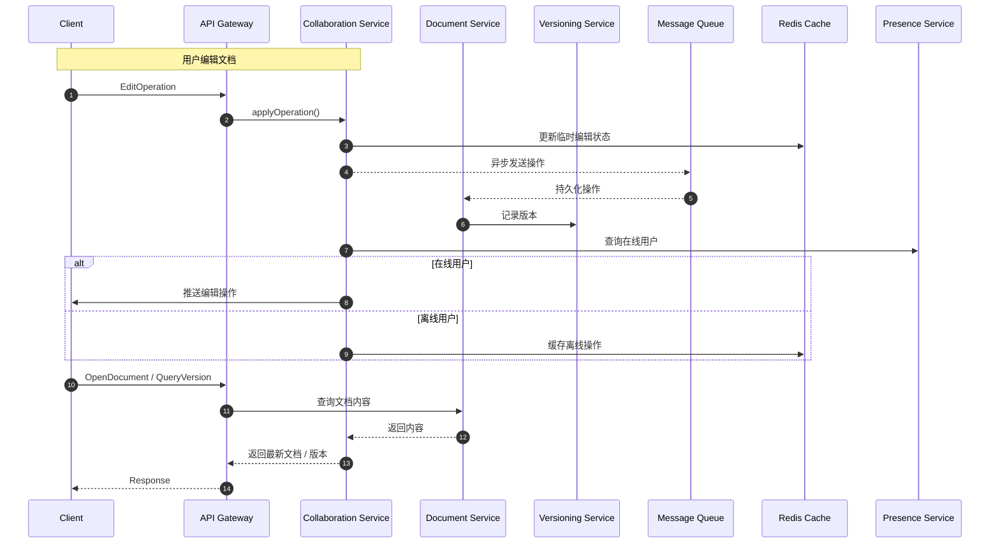

---

## 8. 实时监控系统

### 场景
设计一个指标监控和告警系统，需要实时收集、存储和分析各类指标数据，同时支持告警触发和可视化展示。

### 一、需求澄清
- 功能性需求
    - 系统需要：
        - 实时收集各类指标（CPU、内存、业务指标等）
        - 支持高频数据写入（每秒数十万到数百万条）
        - 数据聚合与查询（实时指标、历史趋势）
        - 告警规则定义与触发（阈值、异常检测）
        - 可视化仪表盘展示
- 非功能性需求
    - 高吞吐、低延迟
    - 支持海量指标和高并发查询
    - 数据可靠存储和最终一致性
    - 系统可水平扩展和高可用

### 三、组件拆解

#### 核心服务拆分
- Metric Collector: 指标采集（Agent/SDK）
- Ingestion Service: 指标写入接口
- Storage Service: 时序数据库 / 分布式存储
- Query / Analytics Service: 指标查询和聚合
- Alerting Service: 告警触发和通知
- Dashboard Service: 可视化展示
- MQ Service: 异步任务（告警、下游处理）
- Cache Service: 热数据缓存

#### 存储选型
- 时序数据库：InfluxDB、Prometheus、OpenTSDB
    - 高吞吐写入，支持时间序列聚合
- 热数据缓存：Redis / 内存缓存
- 异步队列：消息队列 MQ
    - 异步告警通知、下游处理

### 四、数据流

#### 写路径：指标收集
- Agent/SDK 收集指标 → Ingestion Service → 写入 Storage Service → MQ 发布告警任务
- Alerting Service 消费 MQ → 判断告警条件 → 触发通知
- Hot Metrics 缓存到 Redis 提高查询速度

#### 读路径：指标查询和可视化
- Dashboard / 用户查询 → Query Service → 缓存命中返回
- 缓存未命中 → 查询 Storage Service → 返回结果 → 更新缓存
- 可对历史数据进行聚合分析和图表展示

### 五、扩展性与权衡

#### 数据扩展
- 指标按时间、服务或业务维度分片
- 时序数据库支持水平扩展

#### 缓存扩展
- 热指标缓存，提高高频查询性能

#### 服务扩展
- Collector、Ingestion、Query、Alerting 服务无状态，可水平扩展
- MQ 多副本保证告警和异步任务可靠

#### 高可用
- 存储多副本，保证数据可靠
- 告警服务冗余部署
- Dashboard 多副本部署

### 六、限制条件 & 权衡
- 一致性 VS 延迟：允许短时间延迟，保证系统高吞吐
- 缓存 VS 数据新鲜度：缓存提高查询速度，但可能略滞后
- 告警准确性 VS 性能：复杂告警规则可能增加延迟，需权衡

### 七、总结
实时监控系统通过高吞吐写入、异步告警处理和缓存加速，实现海量指标收集、查询和告警通知。结合分布式存储、消息队列和无状态服务，保证系统可扩展性、高可用性和低延迟，同时允许最终一致性来提高吞吐和性能。

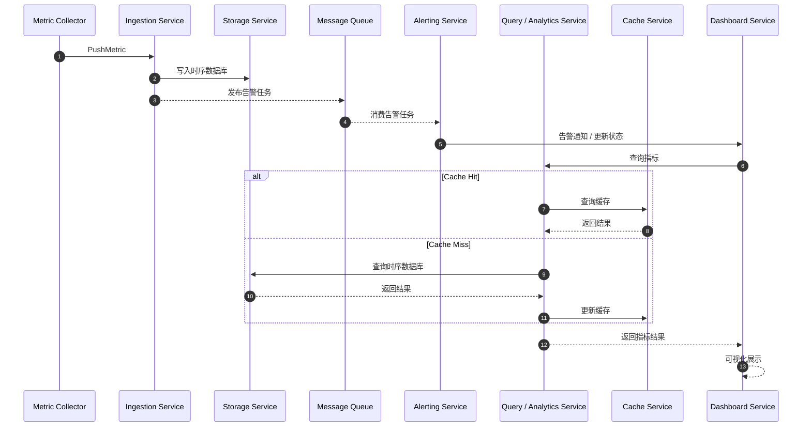

---

## 9. 搜索 + 推荐融合系统

### 场景
设计一个系统，在搜索结果中加入个性化推荐，提高搜索相关性和用户体验。典型场景如电商搜索页、内容搜索页推荐“猜你喜欢”。

### 一、需求澄清
- 功能性需求
    - 支持关键字搜索
    - 在搜索结果中加入个性化推荐
    - 支持排序、过滤和分页
    - 支持搜索和推荐结果点击追踪
    - 实时更新推荐结果（用户行为影响）
- 非功能性需求
    - 高并发查询，低延迟响应
    - 支持海量数据和大规模用户
    - 系统可水平扩展
    - 最终一致性可接受（推荐可能有几秒延迟）

### 三、组件拆解

#### 核心服务拆分
- Search Service: 搜索接口与索引查询
- Recommendation Service: 个性化推荐计算和接口
- Ranking / Fusion Service: 搜索结果和推荐结果融合、排序
- User / Item Service: 用户信息和商品 / 内容信息管理
- Behavior / Event Service: 用户行为收集
- Cache Service: 热搜索结果和推荐结果缓存
- MQ Service: 异步任务处理（离线推荐、行为更新）

#### 存储选型
- 搜索索引：Elasticsearch / Solr
- 离线推荐表：分布式 KV / 数据库
- 用户行为数据：Kafka / MQ / 分布式 DB
- 热点缓存：Redis
- 异步队列：消息队列 MQ

### 四、数据流

#### 写路径：用户行为收集
- 用户搜索、点击或购买行为 → Event Service → MQ → Behavior DB / Offline Processing
- 离线推荐计算 → 更新离线推荐表或 Cache

#### 读路径：搜索 + 推荐融合查询
- 用户发起搜索 → API Gateway → Fusion Service
- Fusion Service 查询：
    - 搜索结果：Search Service → 搜索索引
    - 推荐结果：Recommendation Service → 离线推荐 / 实时计算
- 排序与融合 → 返回给客户端
- 热门搜索和推荐结果可缓存，提高查询性能

### 五、扩展性与权衡

#### 数据扩展
- 搜索索引分片
- 推荐表按用户分区

#### 缓存扩展
- 热门搜索和推荐结果缓存
- 分用户或分查询缓存，提高命中率

#### 服务扩展
- Search Service、Recommendation Service、Fusion Service 无状态，可水平扩展
- 离线推荐计算分布式处理

#### 高可用
- 搜索索引多副本
- 消息队列多副本保证任务可靠
- 推荐服务和融合服务多副本部署

### 六、限制条件 & 权衡
- 一致性 VS 延迟：推荐结果可有几秒延迟，保证高吞吐
- 缓存 VS 数据新鲜度：缓存提高响应速度，但可能略滞后
- 融合策略复杂度 VS 查询性能：排序与融合逻辑越复杂，延迟可能越高

### 七、总结
搜索 + 推荐融合系统通过搜索服务和推荐服务结合，再由融合服务统一排序和返回结果，实现个性化搜索体验。结合缓存、异步行为处理和离线推荐计算，实现低延迟、高可用和可扩展的搜索推荐系统，同时允许最终一致性来保证性能。

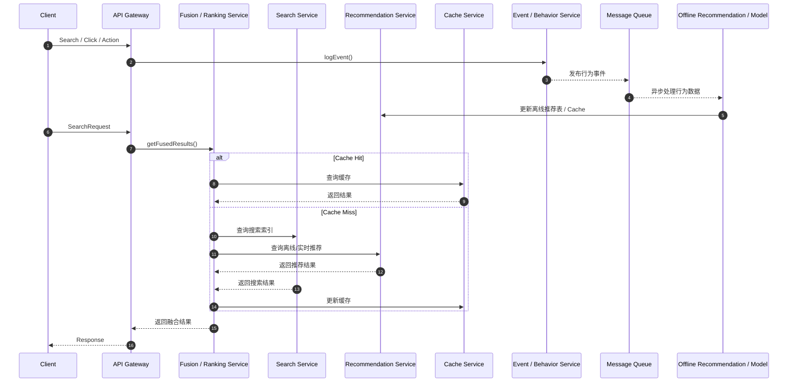

---

## 10. 通用文件上传与 CDN 分发系统

### 场景
设计一个支持大规模文件上传、存储、处理和分发的系统，常用于图片、视频、文档或软件包的上传与全球分发。

### 一、需求澄清
- 功能性需求
    - 用户是否需要：
        - 文件上传（多格式、多大小）
        - 文件存储与版本管理
        - 文件处理（压缩、转码、生成缩略图等，可选）
        - CDN 分发和缓存加速
        - 下载统计和访问日志
- 非功能性需求
    - 高并发上传和下载
    - 高可用和容错
    - 可水平扩展，支持海量文件
    - 支持分布式存储和缓存

### 三、组件拆解

#### 核心服务拆分
- User Service: 用户信息管理
- Upload Service: 文件上传接口
- Processing Service: 文件处理（可选压缩、转码、缩略图）
- Storage Service: 文件持久化存储
- CDN / Distribution Service: 文件缓存和分发
- Metadata Service: 文件元数据管理
- MQ Service: 异步任务处理（文件处理、更新缓存）
- Cache Service: 热文件缓存、下载加速

#### 存储选型
- 原始文件存储：分布式对象存储（S3、MinIO 等）
- 元数据存储：关系型或 NoSQL 数据库
- 热文件缓存：Redis / CDN
- 异步任务队列：消息队列 MQ，用于处理和更新缓存

### 四、数据流

#### 上传路径
- 用户上传文件 → Upload Service → 存储到 Storage Service
- Upload Service 发布处理任务到 MQ → Processing Service 异步处理文件 → Storage Service 保存处理结果
- Metadata Service 更新文件信息和状态
- 文件可通过 CDN 缓存和分发

#### 下载 / 分发路径
- 用户请求文件 → API Gateway → CDN / Cache Service
- 缓存命中：直接返回文件
- 缓存未命中：访问 Storage Service 获取文件 → 更新 CDN / Cache → 返回给用户

### 五、扩展性与权衡

#### 数据扩展
- 文件按对象 ID 分区 / 分桶存储
- 元数据按文件 ID 分库分表

#### 缓存扩展
- 热文件缓存到 CDN / Redis
- 分区域或按文件类型分区，提高缓存命中率

#### 服务扩展
- Upload、Processing、Storage 服务无状态，可水平扩展
- MQ 多副本保证任务可靠

#### 高可用
- 存储多副本保证数据可靠
- Processing 服务多副本
- CDN 多节点分布式部署

### 六、限制条件 & 权衡
- 一致性 VS 性能：上传完成后异步处理文件，提高吞吐但允许短延迟
- 缓存 VS 数据新鲜度：热文件缓存提高访问速度，但可能略滞后
- 存储成本 VS 可访问性：多副本存储提高可靠性但增加成本

### 七、总结
通用文件上传与 CDN 分发系统通过分布式存储、异步任务处理和 CDN 缓存，实现高并发上传、高速下载和全球分发。结合消息队列和无状态服务，保证系统可扩展性、高可用性和低延迟，同时允许最终一致性来提升性能。

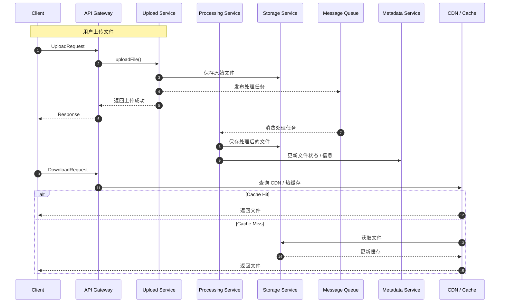

---

## 总结模板（面试必背）

> **我会先澄清需求，然后给出高层架构，接着拆解关键组件，说明数据流，最后重点讨论系统的扩展性、瓶颈和设计权衡, 最后只总结并得出最终的时序图。**
