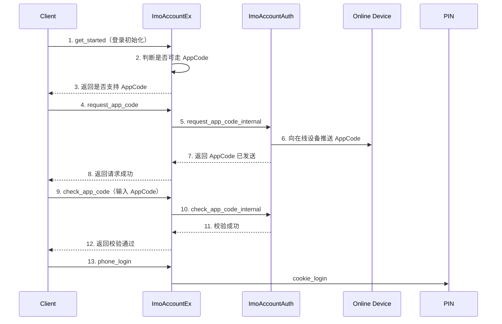

# AppCode 登录业务流程

## 1. 背景
AppCode 登录是一种 **多设备辅助登录方案**，仅在登录及高安全操作场景使用。  
当用户在新设备登录时，如果账号下存在 **可信或在线设备**，系统可向这些设备发送 AppCode，用户在登录端输入 AppCode 即可完成登录，从而 **减少 SMS / Email 等验证码通道成本**。

> 💡 设计目标  
> - 降低短信 / 语音验证码成本  
> - 利用已在线设备提升登录体验  
> - 在成本与账号安全之间取得平衡  

---

## 2. 业务特点与安全边界

- AppCode **不依赖运营商通道**
- 只在 **登录相关流程** 触发
- 不适用于已开启 **高级保护** 的账号
- 展示 AppCode 的设备条件必须严格，否则存在安全风险

---

## 3. 总体流程概览


## 4. 是否可走 AppCode（get_started 判断）

满足以下条件才允许使用 AppCode：
- 未开启 **高级保护**
- 客户端版本满足 **AppCode 要求**
- 单设备 **每日请求次数未超限**
- 不在 **冷却期内**
- 存在 **信任设备** 或 **3 天前登录且当前在线的设备**

---

## 5. AppCode 请求规则（request_app_code）
### 支持场景与有效期
| 场景 | 有效期 |
|----|----|
| 移动端 / PC 登录 | 1 天 |
| 删号 / 删设备 / 换绑号码 | 1 小时 |

### 频控逻辑
```text
if 请求次数 >= 上限 → TOO_MANY
if 未发过 → OK
if 安全类 AppCode 且 15 秒内请求 → TOO_SHORT
if 登录类 AppCode 且 未到下次允许时间 → TOO_SHORT
if 普通 AppCode 且 间隔不足 → TOO_SHORT
```

## 5. 关键说明

- AppCode **仅用于登录及高安全操作**
- 若 AppCode 不可用或校验失败，客户端可降级到 **SMS / Email 验证码流程**
- 核心价值：**降低成本，同时不降低账号安全基线**
